# Kafka

## 第一章 Kafka概述

### 1.1 定义

```tex
Kafka传统定义：Kafka是一个分布式的基于发布/订阅模式的消息队列(MessageQueue），主要应用于大数据实时处理领域。
发布/订阅:消息的发布者不会将消息直接发送给特定的订阅者，而是将发布的消息分为不同的类别，订阅者只接收感兴趣的消息。
Kafka最新定义:Kafka是一个开源的分布式事件流平台（Event StreaminPlatform)，被数千家公司用于高性能数据管道、流分析、数据集成和关键任务应用。
```

### 1.2 消息队列

```tex
目前企业中比较常见的消息队列产品主要有Kafka、ActiveMQ、RabbitMQ、RocketMQ等。
在大数据场景主要采用Kafka作为消息队列。在JavaEE开发中主要采用ActiveMQ、RabbitMQ、RocketMQ。
```

### 1.3 消息队列的应用场景

#### 1、缓存/消峰

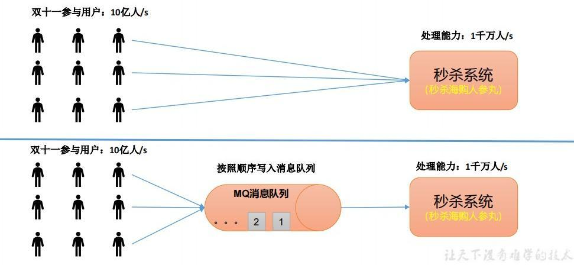

#### 2、解耦

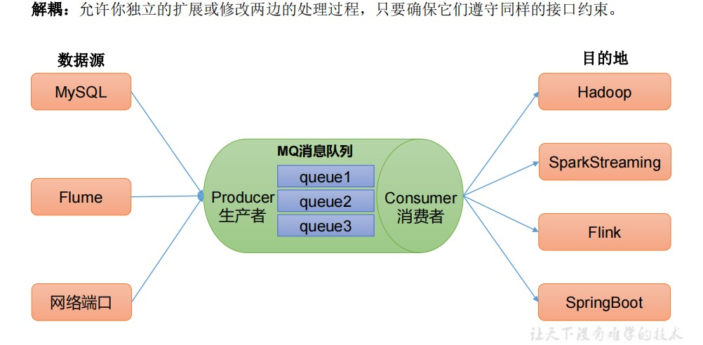

#### 3、异步通信

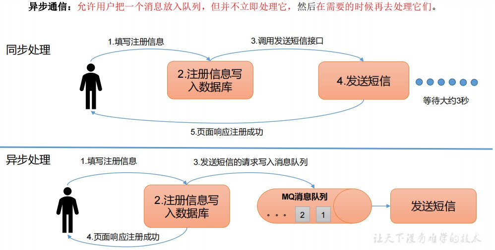

### 1.4 消息队列的两种消费方式

#### 1、点对点模式

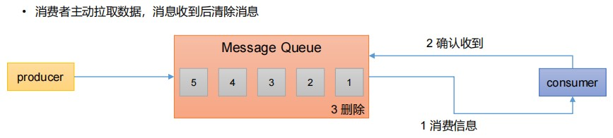

#### 2、发布订阅模式

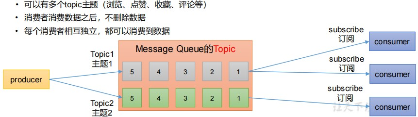

### 1.5 Kafka基础架构

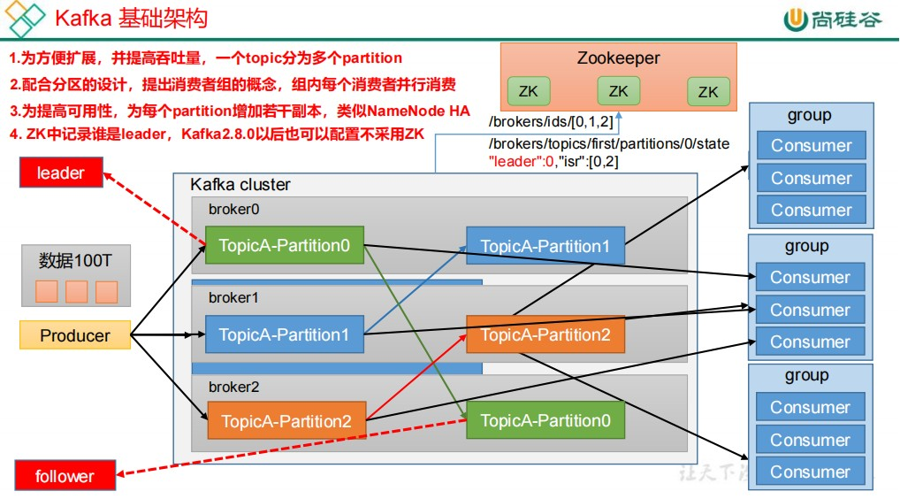

#### 1、Producer

```tex
消息生产者，就是向Kafka broker发消息的客户端。
```

#### 2、Consumer

```tex
消息消费者，向Kafka broker 取消息的客户端。
```

#### 3、Consumer Group

```tex
Consumer Group (CG):消费者组，由多个consumer组成。消费者组内每个消费者负责消费不同分区的数据，一个分区只能由一个组内消费者消费;消费者组之间互不影响。所有的消费者都属于某个消费者组，即消费者组是逻辑上的一个订阅者。
```

#### 4、Broker

```tex
一台Kafka服务器就是一个broker。一个集群由多个broker组成。一个broker可以容纳多个topic。
```

#### 5、Topic

```tex
可以理解为一个队列，生产者和消费者面向的都是一个 topic。
```

#### 6、Partition

```tex
为了实现扩展性，一个非常大的 topic 可以分布到多个 broker（即服务器）上，一个 topic 可以分为多个 partition，每个 partition 是一个有序的队列。
```

#### 7、Replica

```tex
副本。一个 topic 的每个分区都有若干个副本，一个 Leader 和若干个Follower。
```

#### 8、Leader

```tex
每个分区多个副本的“主”，生产者发送数据的对象，以及消费者消费数据的对象都是 Leader。
```

#### 9、Follower

```tex
每个分区多个副本中的“从”，实时从 Leader 中同步数据，保持和Leader 数据的同步。Leader 发生故障时，某个 Follower 会成为新的 Leader。
```

## 第二章 Kafka生产者

#### 2.1、发送原理

```tex
在消息发送的过程中，涉及到了两个线程——main 线程和 Sender 线程。在 main 线程中创建了一个双端队列 RecordAccumulator。main 线程将消息发送给 RecordAccumulator，Sender线程不断从RecordAccumulator中拉取消息发送到 Kafka Broker。
```

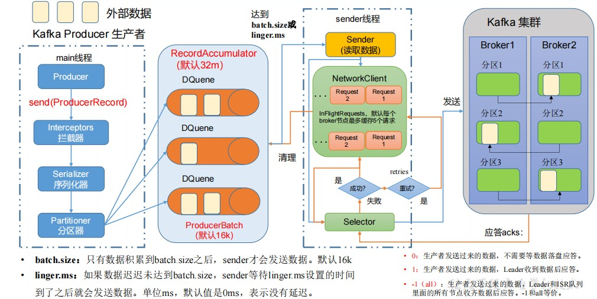

#### 2.2、生产者重要参数

##### 1、bootstrap.servers 

```tex
Kafka集群地址，可以设置一个或多个，中间用逗号分隔。
```

##### 2、key.serializer、value.serializer

```tex
指定发送消息的 key 和 value 的序列化类型。一般写org.apache.kafka.common.serialization.StringSerializer。
```

##### 3、buffer.memory 

```tex
缓冲区总大小，默认 32m。
生产者可以用来缓冲等待发送到服务器的记录的总内存字节数。如果记录的发送速度超过了它们可以发送到服务器的速度，则生产者将阻塞`max.block.ms`之后将抛出异常。
```

##### 4、compression.type

```tex
消息发送压缩类型。默认不压缩。有效值为 none、gzip、snappy、lz4和zstd。
```

##### 5、batch.size 

```tex
缓冲区一批数据最大值，默认 16384(16k)。适当增加该值，可以提高吞吐量，但是如果该值设置太大，会导致数据传输延迟增加。
```

##### 6、linger.ms 

```tex
如果数据迟迟未达到 batch.size，sender 等待 linger.time之后就会发送数据。单位 ms，默认值是 0ms，表示没有延迟。生产环境建议该值大小为 5-100ms 之间。
```

##### 7、acks 

```tex
0：生产者发送过来的数据，不需要等数据落盘应答。
1：生产者发送过来的数据，Leader 收到数据后应答。
-1（all）：生产者发送过来的数据，Leader和 isr 队列里面的所有节点收齐数据后应答。默认值是-1，-1 和all 是等价的。
```

##### 8、max.in.flight.requests.per.connection

```tex
允许最多没有返回 ack 的次数，默认为 5，开启幂等性要保证该值是 1-5 的数字。
```

##### 9、retries 

```tex
当消息发送出现错误的时候，系统会重发消息。retries表示重试次数。默认是 int 最大值，2147483647。如果设置了重试，还想保证消息的有序性，需要设置MAX_IN_FLIGHT_REQUESTS_PER_CONNECTION=1否则在重试此失败消息的时候，其他的消息可能发送成功了。用户通常应该更喜欢不设置此配置，而是使用它delivery.timeout.ms来控制重试行为。
```

##### 10、retry.backoff.ms 

```tex
两次重试之间的时间间隔，默认是 100ms。
```

##### 11、enable.idempotence

```tex
是否开启幂等性，默认 true，开启幂等性。
```

##### 12、delivery.timeout.ms

```tex
发送信息成功或失败的时间上限。这限制了记录在发送之前将被延迟的总时间、等待代理确认的时间（如果需要）以及可重试发送失败所允许的时间。此配置的值应大于或等于request.timeout.ms(默认30s)和linger.ms之和。
```

##### 13、enable.idempotence

```tex
启用幂等性要求max.in.flight.requests.per.connection小于或等于 5（保留任何允许值的消息顺序），retries大于 0，并且acks必须为-1。如果没有设置冲突配置，则默认启用幂等性。如果设置了冲突配置并且没有显式启用幂等性，则禁用幂等性。如果显式启用了幂等性并且设置了冲突的配置，ConfigException抛出异常。
```

#### 2.3、分区

##### 1、分区的好处

```tex
1、便于合理使用存储资源，每个Partition在一个Broker上存储，可以把海量的数据按照分区切割成一块一块数据存储在多台Broker上。合理控制分区的任务，可以实现负载均衡的效果。
```

```tex
2、提高并行度，生产者可以以分区为单位发送数据；消费者可以以分区为单位进行消费数据。
```

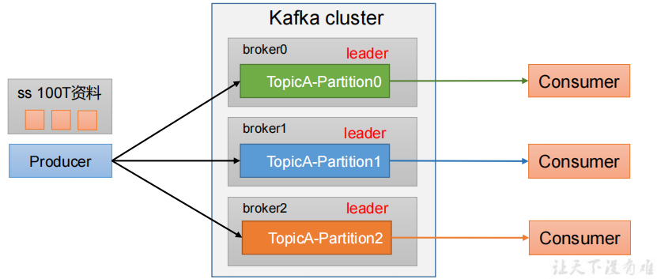

##### 2、默认的分区器

```tex
DefaultPartitioner：
1、指明partition的情况下，直接将指明的值作为partition值；例如partition=0，所有数据写入分区0。
2、没有指明partition值但有key的情况下，将key的hash值与topic的partition数进行取余得到partition值。
3、既没有partition值又没有key值的情况下，Kafka采用Sticky Partition（黏性分区器），会随机选择一个分区，并尽可能一直使用该分区，待该分区的batch已满或者已完成，Kafka再随机一个分区进行使用（和上一次的分区不同）。
```

##### 3、自定义分区器

```java
public interface Partitioner extends Configurable, Closeable {

    /**
     * Compute the partition for the given record.
     *
     * @param topic The topic name
     * @param key The key to partition on (or null if no key)
     * @param keyBytes The serialized key to partition on( or null if no key)
     * @param value The value to partition on or null
     * @param valueBytes The serialized value to partition on or null
     * @param cluster The current cluster metadata
     */
    int partition(String topic, Object key, byte[] keyBytes, Object value, byte[] valueBytes, Cluster cluster);

    /**
     * This is called when partitioner is closed.
     */
    void close();

    /**
     * Notifies the partitioner a new batch is about to be created. When using the sticky partitioner,
     * this method can change the chosen sticky partition for the new batch. 
     * @param topic The topic name
     * @param cluster The current cluster metadata
     * @param prevPartition The partition previously selected for the record that triggered a new batch
     */
    default void onNewBatch(String topic, Cluster cluster, int prevPartition) {
    }
}
```

实现`Partitioner`接口，重写`partition`方法返回分区号。

### 第三章 Kafka消费者

#### 3.1、消费方式

> pull（拉）模 式

```tex
consumer采用从broker中主动拉取数据。Kafka采用这种方式。
```

> push（推）模式

```tex
Kafka没有采用这种方式，因为由broker决定消息发送速率，很难适应所有消费者的消费速率。
```

#### 3.2、消费者组

> Consumer Group（CG）：消费者组，由多个consumer组成。形成一个消费者组的条件，是所有消费者的groupid相同。

```tex
• 消费者组内每个消费者负责消费不同分区的数据，一个分区只能由一个组内消费者消费。 
• 消费者组之间互不影响。所有的消费者都属于某个消费者组，即消费者组是逻辑上的一个订阅者。
```

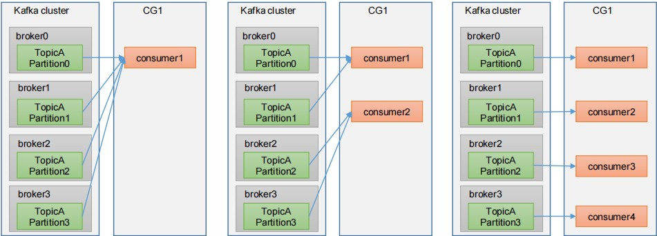

> 注意点：

```tex
• 如果向消费组中添加更多的消费者，超过主题分区数量，则有一部分消费者就会闲置，不会接收任何消息。
• 消费者组之间互不影响。所有的消费者都属于某个消费者组，即消费者组是逻辑上的一个订阅者。
```

#### 3.3、消费者重要参数

##### 1、bootstrap.servers

```tex
向 Kafka 集群建立初始连接用到的 host/port 列表。
```

##### 2、key.deserializer 、value.deserializer

```tex
指定接收消息的 key 和 value 的反序列化类型。一定要写全类名。
```

##### 3、group.id 

```tex
消费者组id。
```

##### 4、enable.auto.commit 

```tex
默认值为 true，消费者会自动周期性地向服务器提交偏移量。
```

##### 5、auto.commit.interval.ms 

```tex
如果设置了 enable.auto.commit 的值为 true， 则该值定义了消费者偏移量向 Kafka 提交的频率，默认 5s。
```

##### 6、auto.offset.reset

```tex
当 Kafka 中没有初始偏移量或当前偏移量在服务器中不存在（如，数据被删除了），该如何处理？
earliest：自动重置偏移量到最早的偏移量。 
latest：默认，自动重置偏移量为最新的偏移量。 
none：如果消费组原来的（previous）偏移量不存在，则向消费者抛异常。
anything：向消费者抛异常。
```

##### 7、offsets.topic.num.partitions 

```tex
__consumer_offsets 的分区数，默认是 50 个分区。
```

##### 8、heartbeat.interval.ms 

```tex
Kafka 消费者和 coordinator 之间的心跳时间，默认 3s。该条目的值必须小于 session.timeout.ms ，也不应该session.timeout.ms 的 1/3。
```

##### 9、session.timeout.ms 

```tex
Kafka 消费者和 coordinator 之间连接超时时间，默认 45s。超过该值，该消费者被移除，消费者组执行再平衡。
```

##### 10、max.poll.interval.ms

```tex
消费者处理消息的最大时长，默认是 5 分钟。超过该值，该消费者被移除，消费者组执行再平衡。
```

##### 11、fetch.min.bytes 

```tex
默认 1 个字节。消费者获取服务器端一批消息最小的字节
数。
```

##### 12、fetch.max.wait.ms 

```tex
默认 500ms。如果没有从服务器端获取到一批数据的最小字节数。该时间到，仍然会返回数据。
```

##### 13、fetch.max.bytes

```tex
默认 Default: 52428800（50 m）。消费者获取服务器端一批消息最大的字节数。如果服务器端一批次的数据大于该值（50m）仍然可以拉取回来这批数据，因此，这不是一个绝对最大值。一批次的大小受 message.max.bytes （broker config）or max.message.bytes （topic config）影响。
```

##### 14、max.poll.records

```tex
一次 poll 拉取数据返回消息的最大条数，默认是 500 条。
```

### 第四章 生产经验

#### 4.1、生产者提高吞吐量


```tex
batch.size：默认16384(16k)，提高批次大小。
linger.ms：等待时间，默认不等待，修改为5-100ms。
compression.type：默认不压缩，设置信息压缩格式为 snappy。
buffer.memory：缓冲区大小，默认为33554432(32m)，修改为64m
```

#### 4.2、数据可靠性


```tex
acks=0，生产者发送过来数据就不管了，可靠性差，效率高；
acks=1，生产者发送过来数据Leader应答，可靠性中等，效率中等；
acks=-1，生产者发送过来数据Leader和ISR队列里面所有Follwer应答，可靠性高，效率低；
在生产环境中，acks=0很少使用；acks=1，一般用于传输普通日志，允许丢个别数据；acks=-1，一般用于传输和钱相关的数据，对可靠性要求比较高的场景。
```

**总结：**数据完全可靠条件 = ACK级别设置为-1 + 分区副本大于等于2 + ISR里应答的最小副本数量大于等于2。
**数据可靠性分析：**如果分区副本设置为1个，或者ISR里应答的最小副本数量（ min.insync.replicas 默认为1）设置为1，和ack=1的效果是一样的，仍然有丢数的风险（leader：0，isr:0）。

**思考**：Leader收到数据，所有Follower都开始同步数据，但有一个Follower，因为某种故障，迟迟不能与Leader进行同步，那这个问题怎么解决呢？

```tex
Leader维护了一个动态的in-sync replica set（ISR），意为和Leader保持同步的Follower+Leader集合(leader：0，isr:0,1,2)。
如果Follower长时间未向Leader发送通信请求或同步数据，则该Follower将被踢出ISR。该时间阈值由replica.lag.time.max.ms参数设定，默认30s。这样就不用等长期联系不上或者已经故障的节点。
```

#### 4.3、数据去重

##### 1、数据传递语义

```tex
至少一次（At Least Once）= ACK级别设置为-1 + 分区副本大于等于2 + ISR里应答的最小副本数量大于等于2 
最多一次（At Most Once）= ACK级别设置为0 
```

##### 2、生产者数据重复

```tex
At Least Once可以保证数据不丢失，但是不能保证数据不重复；
At Most Once可以保证数据不重复，但是不能保证数据不丢失。
精确一次（Exactly Once）：对于一些非常重要的信息，比如和钱相关的数据，要求数据既不能重复也不丢失。
Kafka 0.11版本以后，引入了一项重大特性：幂等性和事务。
```

##### 3、幂等性

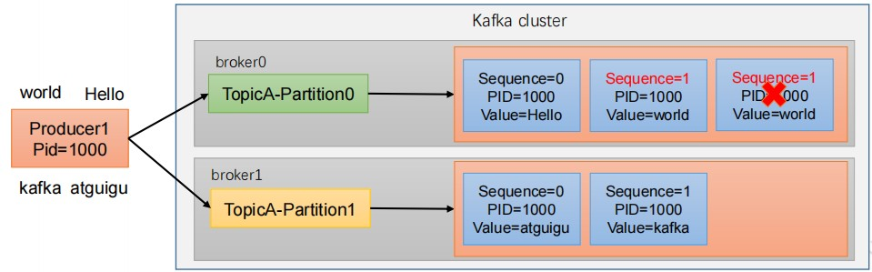

> 幂等性原理

```tex
幂等性就是指Producer不论向Broker发送多少次重复数据，Broker端都只会持久化一条，保证了不重复。
```

> 重复数据的判断标准

```tex
具有<PID, Partition, SeqNumber>相同主键的消息提交时，Broker只会持久化一条。其中PID是生产者每次重启都会分配一个新的；Partition 表示分区号；Sequence Number是单调自增的。
总结：开启参数 enable.idempotence 默认为 true。幂等性只能保证的是在单分区单会话内不重复。
```

##### 4、生产者事务

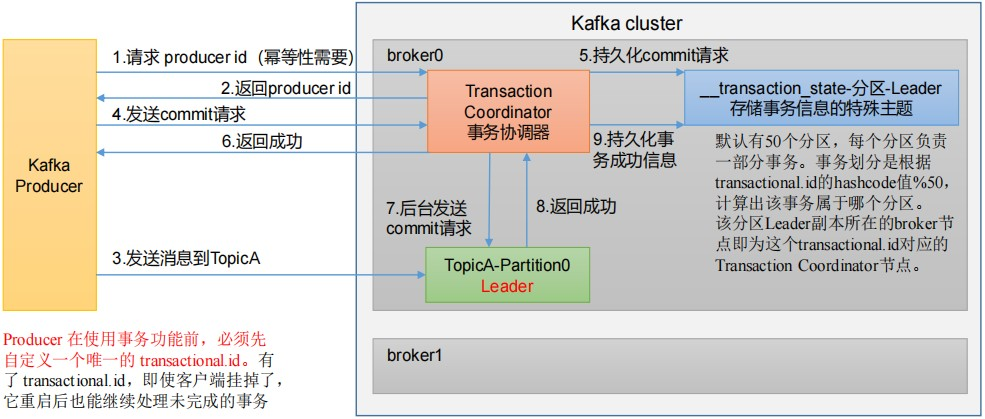

> 注意：开启事务，必须开启幂等性并设置一个transacation.id。

#### 4.4、数据乱序

> 解决方案：

##### 1、kafka在1.x版本之前

> **max.in.flight.requests.per.connection** = 1（不需要考虑是否开启幂等性）。 

##### 2*、kafka在1.x及以后

> （1）未开启幂等性
>
> `max.in.flight.requests.per.connection` = 1
>
> （2）开启幂等性
>
> `max.in.flight.requests.per.connection` <= 5 
>
> 原因说明：因为在kafka1.x以后，启用幂等后，kafka服务端会缓存producer发来的最近5个request的元数据，故无论如何，都可以保证最近5个request的数据都是有序的。

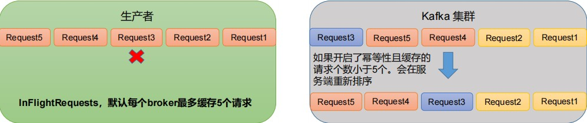

==个人发现一个现象，开启`Kafka`事务后，数据库`Mysql`事务失效了。==

#### 4.5、消息如何生成唯一TraceId

可以使用MD5对消息进行加密，这样同一个消息下发TraceId一定是相同的。

### 第五章 Kafka集成

##### 5.1、集成SpringBoot

###### 1、添加依赖

```xml
<dependency>
    <groupId>org.springframework.kafka</groupId>
    <artifactId>spring-kafka</artifactId>
</dependency>
```

###### 2、yml配置

```yaml
spring:
  kafka:
    # kafka集群地址
    bootstrap-servers: 192.168.39.100:9092,192.168.39.101:9092,192.168.39.102:9092
    consumer:
      # 消费者组id
      group-id: consumer-group
      # 关闭自动提交偏移量
      enable-auto-commit: false
    # 生产者配置
    producer:
      # 引发
      acks: all
    listener:
      # 手动立即提交偏移量，与`enable-auto-commit=false`配合
      ack-mode: MANUAL_IMMEDIATE
```

##### 5.2、生产者

```java
@Autowired
private IAccountService accountService;
```

###### 1、异步发送

```java
// 默认是异步发送
kafkaTemplate.send("flink-input", objectMapper.writeValueAsString(sourceDataEvent));
```

###### 2、同步发送

```java
// get方法会阻塞，一直到返回结果
kafkaTemplate.send("flink-input", objectMapper.writeValueAsString(sourceDataEvent)).get();
```

###### 3、异步回调

```java
ListenableFuture<SendResult<String, Object>> listenableFuture = kafkaTemplate.send("learn-topic", message);
listenableFuture.addCallback(new ListenableFutureCallback<SendResult<String, Object>>() {
    @Override
    public void onFailure(Throwable throwable) {
        //失败回调
    }

    @Override
    public void onSuccess(SendResult<String, Object> stringObjectSendResult) {
        // 成功回调
    }
});
```

##### 5.3 消费者

```java
@KafkaListener(topics = {"learn-topic"})
public void finkToKafka(ConsumerRecord<?, ?> record, Acknowledgment ack) {
    System.out.println("数据消费：" + records);
    // 手动提交偏移量
    ack.acknowledge();
}
```

##### 5.4、批量消费

###### 1、yml配置

```yaml
spring:
  kafka:
    consumer:
      # 一次消费的数据
	  max-poll-records: 5
```

###### 2、消费者

```java
@KafkaListener(topics = {"learn-topic"})
public void finkToKafka(List<ConsumerRecord<?, ?>> records, Acknowledgment ack) {
    // records.size() <= 5
    System.out.println(Thread.currentThread().getId() + "数据消费" + records);
    ack.acknowledge();
}
```

##### 5.5、Kafka事务

> 业务场景，可以让mysql事务和Kafka事务绑定在一起，要么mysql事务和Kafka发送消息一起成功，要么一起失败。
>
> Kafka事务发送消息都是未提交的消息，只有提交事务后，消息才会变成已提交，需要设置`isolation-level=read_committed`，否则消费者会消费到未提交的事务信息。

###### 1、yml配置

```yaml
spring:
  kafka:
    producer:
	  # 事务前缀，开启事务
      transaction-id-prefix: kafka-transaction
      # 设置事务隔离级别为读已提交：默认是读未提交
      isolation-level: read_committed
```

###### 2、消费者

> 开启事务后，只能发送事务消息，否则会报错。同时有两种发送事务消息的方式。

```java
public void producer() {
    kafkaTemplate.executeInTransaction(template -> {
        template.send("learn-topic", 0, null, json);
        return true;
    });
}
// 或
@Transactional  // 可以结合mysql保持事务统一
public void producer() {
    template.send("learn-topic", 0, null, json);
} 
```

==开启Kafka事务后会造成Mysql事务失效==

###### 3、解决Kafka事务后造成的Mysql事务失效

- [x] 添加依赖，如果没有的话

```xml
<dependency>
    <groupId>org.springframework.data</groupId>
    <artifactId>spring-data-commons</artifactId>
</dependency>
```

- [x] 事务配置类

```java
@Configuration
public class TransactionConfig {
    private final DataSource dataSource;

    private final ObjectProvider<TransactionManagerCustomizers> transactionManagerCustomizers;

    TransactionConfig(DataSource dataSource,
                      ObjectProvider<TransactionManagerCustomizers> transactionManagerCustomizers) {
        this.dataSource = dataSource;
        this.transactionManagerCustomizers = transactionManagerCustomizers;
    }

    @Bean
    @Primary
    public DataSourceTransactionManager transactionManager(DataSourceProperties properties) {
        DataSourceTransactionManager transactionManager = new DataSourceTransactionManager(this.dataSource);
        transactionManagerCustomizers.ifAvailable((customizers) -> customizers.customize(transactionManager));
        return transactionManager;
    }

    @Bean
    public ChainedKafkaTransactionManager chainedKafkaTransactionManager(DataSourceTransactionManager transactionManager,
                                                                         KafkaTransactionManager<?, ?> kafkaTransactionManager) {
        return new ChainedKafkaTransactionManager<>(transactionManager, kafkaTransactionManager);
    }
}
```

- [x] 原因分析

**Mysql事务管理器自动装配源码**

```java
@Configuration(proxyBeanMethods = false)
@ConditionalOnClass({ JdbcTemplate.class, PlatformTransactionManager.class })
@AutoConfigureOrder(Ordered.LOWEST_PRECEDENCE)
@EnableConfigurationProperties(DataSourceProperties.class)
public class DataSourceTransactionManagerAutoConfiguration {

	@Configuration(proxyBeanMethods = false)
	@ConditionalOnSingleCandidate(DataSource.class)
	static class DataSourceTransactionManagerConfiguration {

		@Bean
		@ConditionalOnMissingBean(PlatformTransactionManager.class)
		DataSourceTransactionManager transactionManager(DataSource dataSource,
				ObjectProvider<TransactionManagerCustomizers> transactionManagerCustomizers) {
			DataSourceTransactionManager transactionManager = new DataSourceTransactionManager(dataSource);
			transactionManagerCustomizers.ifAvailable((customizers) -> customizers.customize(transactionManager));
			return transactionManager;
		}

	}

}
```


因为@ConditionalOnMissingBean(PlatformTransactionManager.class)的作用是如果容器中已经有TransactionManager类型的bean的话则不创建DataSourceTransactionManager，所以kafka开启事务后创建了kafkaTransactionManager故不再创建DataSourceTransactionManager，所以数据库事务失效了。
